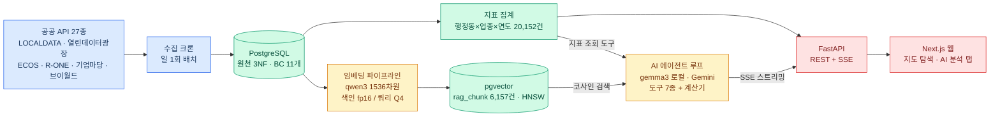

# 3) 개발 항목 상위 설계서

## 개발개요

시스템은 **수집 → 적재 → 집계 → 서빙 → AI 분석**의 5단 데이터 흐름으로 구성된다. 설계 원칙(3계층 ERD, Fractal 11-File Set, Bounded Context 분리)은 [시스템 아키텍처]({{ '/docs/requirements/architecture.html' | relative_url }})에, 코드 규칙은 [개발 표준]({{ '/docs/guidelines/standards.html' | relative_url }})에 정리되어 있다.

## Data Flow (아키텍처링)

모듈별 색 구분: <span style="color:#2563eb">■ 수집·적재(파랑)</span> · <span style="color:#059669">■ 데이터 계층(초록)</span> · <span style="color:#d97706">■ AI 계층(주황)</span> · <span style="color:#dc2626">■ 서빙·프론트(빨강)</span>



### AI Model 학습/추론 및 Module 별 AI 연동 체계

```mermaid
flowchart TB
  classDef ai fill:#fef3c7,stroke:#d97706,color:#78350f
  classDef data fill:#d1fae5,stroke:#059669,color:#064e3b
  classDef eval fill:#e0e7ff,stroke:#4f46e5,color:#312e81

  S1[색인 임베딩<br>qwen3-embedding fp16<br>새벽 크론 05:50 GPU 배치]:::ai
  S2[쿼리 임베딩<br>qwen3-embedding Q4<br>Ollama 상시 서빙]:::ai
  S3[에이전트 두뇌<br>gemma3 로컬 우선<br>Gemini 비교 평가]:::ai
  V[(pgvector HNSW)]:::data
  E[Recall@5 평가 하네스<br>기준선 0.900 / MRR 0.782<br>목표 91.5%]:::eval

  S1 -->|"문서 벡터 업서트"| V
  S2 -->|"질의 벡터"| V
  V -->|"top-k 청크"| S3
  S3 -->|"도구 호출 · 리포트 생성"| E
  E -.->|"모델 비교 결과 반영"| S3
```

## 개발환경

| 구분 | 내용 |
|---|---|
| 개발 | 로컬 GPU 서버 (Linux), Docker Compose, Python venv, Node 22 |
| 저장소 | GitHub (백엔드·프론트 모노레포 + 문서 사이트 분리) |
| 배포 | 문서: GitHub Pages / 서비스: 로컬 → AWS 이전 예정 |

## 주요 기술요소 (SW Stack / Infra Stack)

| 계층 | 기술 |
|---|---|
| 백엔드 | FastAPI, SQLAlchemy + Alembic, pytest (TDD) |
| DB / Infra | PostgreSQL + pgvector(HNSW), Docker Compose, crontab 배치 |
| AI | Ollama (gemma3, qwen3-embedding 4B), Google Gemini, sentence-transformers(fp16 색인) |
| 프론트엔드 | Next.js (App Router) + TypeScript, Tailwind CSS v4, MapLibre GL, TanStack Query v5 |
| 외부 연동(API) | LOCALDATA, 서울 열린데이터광장, ECOS, R-ONE, 기업마당, 브이월드(WMTS·WFS·지오코딩), 빅카인즈·네이버 뉴스 |

## 요구사항 별 기술요소

### 요구사항 #1 — 지도 기반 상권 탐색 · 구현목표/설명

행정동 경계 GeoJSON(427개, 좌표 절삭 5.4MB→gzip 849KB)을 캐시 프록시로 서빙하고, 사전 집계된 `region_industry_metric`으로 지도 응답 지연을 제거한다. MapLibre 코로플레스 이산 7클래스 + 범례로 판독성을 확보한다.

### 요구사항 #2 — AI 창업 분석 리포트 · 구현목표/설명

임베딩을 색인(fp16 정밀)과 쿼리(Q4 경량)로 분리해 GPU 상주 부담 없이 1536차원 규격을 통일한다. 에이전트는 LLM 게이트웨이 포트 뒤에 gemma3·Gemini를 어댑터로 두고, 도구 레지스트리(지표 조회·RAG 검색·계산기 등 7종)를 루프에서 호출해 SSE로 스트리밍한다.

### 요구사항 #3 — 정책자금·금융 계산기 · 구현목표/설명

기업마당 공고를 멱등 업서트 + 일 배치 만료 처리로 최신 상태를 유지하고, ECOS 대출금리 3계열·R-ONE 임대료를 근거로 손익분기를 계산한다. 금소법 경계(정보 제공까지만)를 UseCase 레벨에서 강제한다.

## 시나리오 테스트

단위→통합 테스트 전략은 [시나리오 테스트]({{ '/docs/deliverables/test-scenario.html' | relative_url }}) 산출물에서 상세히 다룬다. 개발 단계에서는 TDD(실패 테스트 선행)를 표준으로 하며, 품질 체계는 [품질 관리 및 테스트]({{ '/docs/guidelines/quality.html' | relative_url }})를 따른다.
