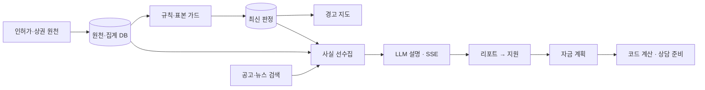

# 3) 개발 항목 상위 설계서

## 개발개요

경고 등급을 계산하는 부분과 그 근거를 설명하는 부분을 분리합니다. 사용자에게는 지도에서 판정과 이유를 먼저 보여주고 리포트·지원·자금 준비로 이어집니다.

## Data Flow (아키텍처링)

```mermaid
flowchart LR
  A[인허가·상권 원천] --> B[(원천·집계 DB)]
  B --> C[규칙·표본 가드]
  C --> D[(최신 판정)]
  D --> E[경고 지도]
  D --> F[사실 선수집]
  B --> F
  G[공고·뉴스 검색] --> F
  F --> H[LLM 설명 · SSE]
  H --> I[리포트 → 지원]
  I --> J[자금 계획]
  J --> K[코드 계산 · 상담 준비]
```

### AI Model 학습/추론 및 Module 별 AI 연동 체계

현재 판정은 학습 모델이 아니라 규칙입니다. `rag`는 임베딩·코사인 검색을, `agent`는 사실을 전달받아 설명을 만드는 LLM 호출을 담당합니다. 색인과 질문의 임베딩 포트를 구분하며 모델별 검색 결과는 별도 실험으로 비교했습니다. 학습된 폐업 확률 모델은 현재 구현으로 제시하지 않습니다.

## 개발환경

로컬 개발 환경에서는 Next.js·FastAPI와 PostgreSQL·pgvector를 사용하며 임베딩·LLM의 외부 의존이 있습니다. 문서 사이트는 Jekyll입니다. 실제 서비스 주소는 [beyondfacade.cloud](https://beyondfacade.cloud)이며 최종 운영 설정은 별도 검수 대상입니다.

## 주요 기술요소 (SW Stack / Infra Stack)

| 영역 | 구성 | 선택의 이유 |
|---|---|---|
| 백엔드 | FastAPI, SQLAlchemy, Alembic | API 계약과 스키마 변경 관리 |
| 판정 | Specification·규칙 목록·업종 원천 Strategy | 신호 근거와 데이터 차이를 명시적으로 관리 |
| DB·검색 | PostgreSQL, pgvector | 정형 지표와 근거 문서 검색 연결 |
| 리포트 | LLM 게이트웨이·사실 수집·SSE | 실패 격리와 사실/설명 책임 분리 |
| 프론트 | Next.js·React·TypeScript·TanStack Query·MapLibre | 조건 전달·지도·비동기 상태 표시 |
| 검증 | pytest·Vitest·검색 평가·판정 백테스트 | 코드 동작과 통계 검증의 분리 |

## 요구사항 별 기술요소

### 요구사항 #1 — 창업 경고와 근거

`GET /regions/geojson`과 `GET /verdicts?industry=`를 읽어 지도를 그리고 선택 동의 단건 판정·대안·요약을 각각 조회합니다. 최신 판정은 `region_industry_verdict`에 저장됩니다.

### 요구사항 #2 — 설명 리포트

13개 사실 키를 먼저 구성합니다. 항목 실패를 격리하고 LLM 출력의 섹션 마커를 스트림 분할기가 처리해 6개 절에 전달합니다. 자세한 구현은 [상세 설계서]({{ '/docs/deliverables/detailed-design.html' | relative_url }})에 있습니다.

### 요구사항 #3 — 지원·자금 계획

지원 후보 선정은 지역·업종 규칙으로 수행하고 자금 계획은 `finance` 엔진으로 계산합니다. 참고 금리·평균 매출을 개별 사용자 확정값으로 해석하지 않습니다.

## 시나리오 테스트

[시나리오 테스트]({{ '/docs/deliverables/test-scenario.html' | relative_url }})에서 보류·제외·빈 대안·부분 실패·입력 변경을 확인합니다. [검증 결과와 원문 근거]({{ '/docs/evidence.html' | relative_url }})에서 실험 기록과 목표를 분리합니다.
