# 메타볼레 — ERD

> **Status:** v2.0 (2026-09-17) — **실DB 스키마 기준.** 운영 DB의 `information_schema`(컬럼·PK·UK·FK)를 직접 조회해 옮겼다. 문서와 DB가 어긋나면 DB가 맞다.
> **이력:** v1.0(Sprint 1)은 MVP 15테이블 설계 초안이다. 초안 대비 구현 변경분은 §8에 정리했다.
> **설계 규칙:** ① 1NF→3NF 정규화, 역정규화는 집계 계층에만 허용하고 근거를 남긴다 ② 고립 테이블 금지 — 모든 테이블은 마스터 허브(`district`·`region`·`industry`)까지 FK 경로가 있어야 한다 ③ **1 테이블 = 1 Fractal 11-File Set = 1 AI 위임 단위** ([개발 표준 및 산출물]({{ '/docs/guidelines/standards.html' | relative_url }}))

---

## 1. 전체 ERD (구현 기준 — 21 테이블, 4 계층)

테이블은 **마스터 → 원천 → 집계 → 검색** 계층으로 나뉘고, 계층이 곧 데이터 흐름이다. 한 화면에서 관계가 읽히도록 키 컬럼(PK·FK·UK)만 표기했고, 전체 컬럼은 §2~§6의 계층별 표에 있다.

- 실선: DB `FOREIGN KEY` 제약이 걸린 관계
- 점선: DB 제약 없이 애플리케이션에서만 잇는 관계 (사유는 §7)

```mermaid
erDiagram
    %% ── 마스터 계층 ──
    district ||--o{ region : "포함"
    region ||--o{ population_stat : "인구"
    industry ||--o{ industry_subcategory : "세분"
    industry ||--o{ industry_source_code : "코드매핑"

    %% ── 원천 계층: 인허가 ──
    district ||--o{ store : "관할"
    region |o--o{ store : "위치"
    industry ||--o{ store : "업종"
    industry_subcategory |o--o{ store : "서브카테고리"
    store ||--o{ academy_course : "교습과정"
    district ||--o{ tobacco_retailer : "지정관할"
    region |o--o{ tobacco_retailer : "위치"

    %% ── 원천 계층: 스냅샷 ──
    region ||--o{ convenience_store : "수집 단위"
    district ||--o{ childcare_center : "수집 단위"
    region |o--o{ childcare_center : "위치"
    childcare_center ||--o{ childcare_center_stat : "기준일별 현황"

    %% ── 원천 계층: 외생 변수 ──
    district |o--o{ rent_price : "매핑 후속"
    interest_rate }o..o{ rent_price : "계산기 조인"
    shock_event ||--o{ shock_event_industry : ""
    industry ||--o{ shock_event_industry : ""
    shock_event ||--o{ shock_event_region : ""
    region ||--o{ shock_event_region : ""
    region |o--o{ news_article : "관련지역"

    %% ── 집계 계층 ──
    region ||--o{ region_industry_metric : ""
    industry ||--o{ region_industry_metric : ""
    store ||..o{ region_industry_metric : "개폐업 집계"
    convenience_store ||..o{ region_industry_metric : "점포수"
    childcare_center ||..o{ region_industry_metric : "점포수"

    %% ── 검색 계층 (RAG) ──
    region |o--o{ rag_chunk : "지역 필터"
    news_article ||..o{ rag_chunk : "source_type=news"
    funding_program ||..o{ rag_chunk : "source_type=funding"

    district {
        string district_code PK
        string opn_authority_code UK
    }
    region {
        string region_code PK
        string district_code FK
    }
    population_stat {
        string region_code PK, FK
        string period PK
        string gender PK
        int age_from PK
    }
    industry {
        string industry_id PK
    }
    industry_subcategory {
        string subcategory_id PK
        string industry_id FK
    }
    industry_source_code {
        int id PK
        string industry_id FK
    }
    store {
        string store_id PK
        string district_code FK
        string region_code FK "nullable"
        string industry_id FK
        string subcategory_id FK "nullable"
    }
    academy_course {
        string course_id PK
        string store_id FK
    }
    tobacco_retailer {
        string retailer_id PK
        string district_code FK
        string region_code FK "nullable"
    }
    convenience_store {
        string store_id PK
        string region_code FK
    }
    childcare_center {
        string center_id PK
        string district_code FK
        string region_code FK "nullable"
    }
    childcare_center_stat {
        string center_id PK, FK
        date base_date PK
    }
    rent_price {
        string id PK
        string district_code FK "nullable"
    }
    interest_rate {
        string id PK
    }
    shock_event {
        string event_id PK
    }
    shock_event_industry {
        string event_id PK, FK
        string industry_id PK, FK
    }
    shock_event_region {
        string event_id PK, FK
        string region_code PK, FK
    }
    news_article {
        string article_id PK
        string url UK
        string region_code FK "nullable"
    }
    funding_program {
        string program_id PK
        string url UK
    }
    region_industry_metric {
        string region_code PK, FK
        string industry_id PK, FK
        int year PK
    }
    rag_chunk {
        string chunk_id PK
        string source_type "news / funding"
        string source_id "원천 PK 다형 참조"
        vector embedding "vector(1536)"
        string region_code FK "nullable"
    }
```

한 줄 요약: **`region`·`district`·`industry`가 모든 엣지가 모이는 허브이고, 서비스 조회는 `region_industry_metric`(지도)과 `rag_chunk`(AI 검색) 두 곳으로 모인다.** 원천 테이블은 3NF를 엄격히 지키고, 역정규화는 집계 계층에만 둔다.

### 적재 현황 (2026-09-17, `pg_stat_user_tables` 추정치)

| 계층 | 테이블 (행 수) |
|---|---|
| 마스터 | district 25 · region 427 · industry 10 · industry_subcategory 8 · industry_source_code 9 · population_stat 142,632 |
| 원천(인허가) | store 348,792 · academy_course 64,415 · tobacco_retailer 95,402 |
| 원천(스냅샷) | convenience_store 9,395 · childcare_center 3,940 · childcare_center_stat 3,940 |
| 원천(외생 변수) | rent_price 3,638 · interest_rate 365 · shock_event 26 · shock_event_industry 107 · shock_event_region **0** · news_article 4,951 · funding_program 1,849 |
| 집계 | region_industry_metric 21,005 |
| 검색 | rag_chunk 6,645 (news 4,796 · funding 1,849, 전건 임베딩) |

---

## 2. 마스터 계층 — 모든 엣지가 모이는 허브

변화가 거의 없는 기준 데이터다. 원천 테이블은 이 허브에 FK로 연결되어 고립 테이블·고아 컬럼이 생기지 않는다.

| 테이블 | 컬럼 | 비고 |
|---|---|---|
| `district` | district_code(PK), name, opn_authority_code(UQ, nullable) | 서울 25개 자치구. opn_authority_code는 인허가 원천의 개방자치단체코드 매핑용 |
| `region` | region_code(PK), district_code(FK), name, geometry_ref(nullable) | 행정동 427개. geometry_ref는 경계 GeoJSON 경로 |
| `population_stat` | region_code(FK)+period+gender+age_from(복합 PK), age_to(nullable), population | 주민등록 인구. period는 YYYYMM, 5세 구간이며 100세 이상은 age_to가 NULL. 성별 계는 합산으로 도출 |
| `industry` | industry_id(PK), name, demand_type | 업종 10종. demand_type은 수요동인 4유형 |
| `industry_subcategory` | subcategory_id(PK), industry_id(FK), category_axis, target_group(nullable) | 교습계열·미용 세분 같은 업종 내부 분류 축 |
| `industry_source_code` | id(PK), industry_id(FK), source_system, code · UQ(industry_id, source_system, code) | 원천 시스템(LOCALDATA·NEIS·상가정보)별 업종코드 매핑 |

- **1NF:** 인구의 연령대별 수치는 `age_10, age_20…` 컬럼이 아니라 행 단위로 둔다. 업종 1개가 원천 코드를 여러 개 가지는 경우(예: 편의점 = 담배소매인 + 상가정보 코드)도 `industry_source_code`로 분리했다.
- **3NF:** `region`에 자치구명을 두면 이행 종속이 생기므로 `district`를 별도 테이블로 뺐다. 표본이 얇은 업종(노래방·당구장 등)을 자치구 단위로 집계하는 축으로도 쓴다.

## 3. 원천 계층 — 인허가

지자체 인허가 데이터로, 개업일·폐업일이 있어 개폐업 시계열 분석의 원천이 된다.

| 테이블 | 컬럼 | 비고 |
|---|---|---|
| `store` | store_id(PK), name, industry_id(FK), district_code(FK), region_code(FK, nullable), subcategory_id(FK, nullable), open_date, close_date, status_code, status_name, lat, lng, source_updated_at | LOCALDATA 인허가 업종 점포. store_id는 관리번호(MNG_NO). 좌표는 EPSG:5174→WGS84로 변환하고, region_code는 행정동 경계 공간조인 후 채운다. source_updated_at은 증분 수집 커서 |
| `academy_course` | course_id(PK), store_id(FK), course_name, tuition_fee(nullable), target_grade(nullable) | 학원 교습과정·수강료(OA-20528). course_id = store_id:연번. target_grade는 LLM 추출 후속으로 현재 NULL |
| `tobacco_retailer` | retailer_id(PK), name, district_code(FK), region_code(FK, nullable), status_code, status_name, designated_date, permit_date, close_date, cancel_date, lat, lng, road_address, jibun_address, source_updated_at | 담배소매인 지정(인허가 아카이브 CSV). 편의점은 단일 인허가 코드가 없어 지정 여부가 사실상 출점 가능 여부를 정한다 |

- **nullable FK는 의도된 미연결만 허용한다.** `region_code`가 비어 있는 행은 좌표 결측이거나 공간조인 전인 경우다. 그래서 관할 자치구는 원천 코드로 `district_code`(NOT NULL)에 따로 보관한다.
- **`tobacco_retailer`를 `store`에 합치지 않은 이유:** 담배소매인은 점포(업종)가 아니라 지정 권리다. 편의점·슈퍼·가판이 섞여 industry FK가 성립하지 않고, 지정일·취소일처럼 컬럼 축도 다르다.

## 4. 원천 계층 — 스냅샷

원천 API가 "현재 영업 중인 시설"만 돌려주는 데이터다. 폐업 이력이 없으므로 관측일(`first_seen_on`·`last_seen_on`)을 남겨 소실(폐점 추정 후보)을 추적한다.

| 테이블 | 컬럼 | 비고 |
|---|---|---|
| `convenience_store` | store_id(PK), name, branch_name, brand, region_code(FK), lat, lng, road_address, jibun_address, source_stdr_ym, first_seen_on, last_seen_on | 소진공 상가정보 체인화 편의점(G20405) × 행정동 427회 수집. store_id는 상가업소번호(bizesId). brand는 상호에서 추출(GS25·CU·세븐일레븐·이마트24·미니스톱) |
| `childcare_center` | center_id(PK), name, type_name, status_name(nullable), district_code(FK), region_code(FK, nullable), address, zipcode, tel, lat, lng, approved_on, paused_from, paused_until, abolished_on, first_seen_on, last_seen_on | 어린이집정보공개포털 cpmsapi030 × 자치구 25회 수집. 좌표가 등록 자치구 밖이면 좌표 오류로 보고 region_code를 채우지 않는다. 대표자명은 개인 실명이라 수집하지 않음 |
| `childcare_center_stat` | center_id(FK)+base_date(복합 PK), capacity, child_count, waiting_count(nullable), class_count, staff_count | 기준일별 정원·현원·입소대기·반 수·보육교직원 수. 입소대기 공란은 NULL로 보존 |

- **`store`에 합치지 않은 이유:** 스냅샷 원천에는 개폐업 이력이 없다. `store`에 섞으면 `region_industry_metric`의 개업·폐업 지표가 오염된다. 편의점 개폐업 이력은 `tobacco_retailer`가 맡는다.
- **시설/현황 분리 (2NF·이력):** 정원·현원·대기는 (시설, 기준일)에 종속되고 시점마다 변한다. 시설 행에 덮어쓰면 가동률 추이를 되살릴 수 없어서 기준일별 이력 행으로 분리했다.
- **3NF:** `convenience_store`는 수집 단위가 행정동이라 `district_code`를 두지 않는다(region 경유 이행 종속). 원천의 시도명·시군구명도 같은 이유로 버린다.
- **1NF:** 연령별 반·아동·대기 수, 교직원 직종·근속 분포는 컬럼 나열이 되므로 이번에는 수집하지 않았다. 쓰는 곳이 생기면 행 단위 테이블로 추가한다.

## 5. 원천 계층 — 외생 변수

상권 밖에서 들어오는 변수(임대료·금리·특이 이벤트·뉴스·정책자금)다.

| 테이블 | 컬럼 | 비고 |
|---|---|---|
| `rent_price` | id(PK), building_type, cls_id, region_name, region_path, region_level, district_code(FK, nullable), period, rent_per_m2, vacancy_rate, rent_statbl_id, vacancy_statbl_id | R-ONE 임대동향조사. id = building_type:cls_id:period, period는 YYYYQn. 원천 지역 단위가 자치구가 아니라 상권·권역·시도라서 원천 지역명을 보존하고 district_code는 매핑표 구축 후 채운다. statbl_id로 표본 개편(빈티지)을 추적 |
| `interest_rate` | id(PK), rate_type, period, rate, unit, stat_code, item_code | 한국은행 ECOS 시계열. id = rate_type:period, period는 YYYYMM. 금융 계산기 전용이라 region/industry FK가 없다(§7) |
| `shock_event` | event_id(PK), layer, name, start_date, end_date(nullable), scope, source, source_url(nullable), description(nullable) | 특이변수 4계층(①정책 ②거시 ③트렌드 ④지역). scope는 전국·서울·지역 |
| `shock_event_industry` | event_id(FK)+industry_id(FK)(복합 PK), severity | 이벤트↔업종 M:N. 업종별 severity를 함께 기록 |
| `shock_event_region` | event_id(FK)+region_code(FK)(복합 PK) | 이벤트↔행정동 M:N. 테이블·FK는 있으나 적재 0건 |
| `news_article` | article_id(PK), title, description, published_at, url(UQ), matched_keyword, press(nullable), region_code(FK, nullable) | 네이버 뉴스. article_id = sha1(url) 20자리. description은 발췌만 저장하고 본문은 저장하지 않는다. press는 네이버 응답에 언론사명이 없어 nullable |
| `funding_program` | program_id(PK), source, title, org, url(UQ), apply_period, exec_org, field_category, field_subcategory, target_text, hashtags, apply_begin, deadline, summary, posted_at, source_updated_at, is_expired | 기업마당 정책자금 공고. summary는 발췌만 저장하고 원문 링크(url)는 필수. deadline은 상시 공고면 NULL, is_expired는 일 배치로 갱신 |

- **정정 이력:** 초안의 `rent_price.sale_price_avg`(실거래 매매 평균)는 실데이터 확인 전이라 컬럼을 유보했다. `interest_rate`의 은행군·신용등급 컬럼은 은행연합회 공시의 축이라 ECOS 시계열과 섞지 않고, 후속 수집 시 별도 테이블로 둔다.
- **`news_article.event_id`:** 기사를 `shock_event`로 승격하는 기능을 만들 때 컬럼과 FK를 함께 추가한다(구현 유보).

## 6. 집계 · 검색 계층 — 서비스 조회용

| 테이블 | 컬럼 | 비고 |
|---|---|---|
| `region_industry_metric` | region_code(FK)+industry_id(FK)+year(복합 PK), store_count, open_count(nullable), close_count(nullable), closure_rate(nullable), growth_rate(nullable) | 행정동×업종×연도 사전 집계. 지도 단계구분도·요약 카드의 원천. 스냅샷 원천(어린이집·편의점)은 개폐업 이력이 없어 open/close 계열이 NULL |
| `rag_chunk` | chunk_id(PK), source_type, source_id, content, embedding(vector 1536, nullable), embedded_by(nullable), published_at, org, url, region_code(FK, nullable) · IX(source_type, source_id) | RAG 검색 청크(pgvector, HNSW 인덱스). source_type에 따라 `news_article` 또는 `funding_program`의 PK를 가리킨다. embedded_by에 임베딩 모델명을 남겨 색인 모델 혼용을 추적 |

- **집계는 재생성 가능하다.** 원천(`store` 등)이 진실이고 지표는 배치로 다시 만들 수 있어, 불일치가 생기면 배치 재실행으로 복구한다.
- **검색 표현과 원천을 분리했다.** 청킹 전략이나 임베딩 모델이 바뀌어도 원천 테이블은 그대로 두고 `rag_chunk`만 다시 만든다.

---

## 7. 역정규화 · 고립 테이블 검증

**역정규화 현황 (근거 명시):**

| 위치 | 내용 | 근거 |
|---|---|---|
| `region_industry_metric` 테이블 전체 | `store`에서 계산 가능한 집계를 사전 저장 | 지도 API가 요청마다 수십만 행을 집계하면 응답 지연 목표(-40%)를 맞출 수 없다. 일 1회 배치로 신선도는 충분 |
| `region_industry_metric`의 파생 수치 | growth_rate 등은 open/close/store_count에서 유도 가능 | 프론트 차트가 매번 계산하지 않도록 저장. 불일치 시 배치 재실행으로 복구 |
| `store.status_code`·`status_name` | open_date/close_date에서 유도 가능 | 상태 필터 쿼리 빈도가 압도적이라 인덱스를 건 상태 컬럼 유지 |
| `convenience_store.brand` | 상호(name)에서 추출 가능 | 브랜드 분포 조회 축. 원본 상호를 보존하므로 언제든 재추출 가능 |
| `interest_rate` ↔ 지표 테이블 비연결 | 계산기 전용 독립 시계열 | 상권과 무관한 전국 공시 데이터. 계산기 UseCase에서 `rent_price`와 애플리케이션 조인 |

리뷰에서 반려하는 역정규화 예: `store`에 행정동명 저장, 지표 테이블에 업종명 저장. JOIN 한 번으로 해결되는 것은 역정규화 사유가 아니다.

**점선(애플리케이션 레벨) 엣지 사유:**
- `rag_chunk.source_id` — source_type에 따라 가리키는 테이블이 달라지는 다형 참조라 단일 FK 제약을 걸 수 없다.
- `region_industry_metric` ← `store`·`convenience_store`·`childcare_center` — 배치 집계로 생기는 파생 관계이고 행 단위 참조가 아니다.
- `interest_rate` ↔ `rent_price` — 위 역정규화 표의 계산기 앱 조인.

**고립 테이블 검증 (DB FK 기준):** 21테이블 중 19개는 마스터 허브까지 DB FK 경로가 있다. 예외 2건은 다음과 같다.
- `funding_program` — DB FK가 하나도 없고 `rag_chunk` 다형 참조로만 이어진다. 업종 허브와 잇는 `funding_program_industry`가 미구현이라 **후속 구현 대상**이다.
- `interest_rate` — DB FK 없음. 위 역정규화 표에 근거를 둔 의도된 예외다.

그 밖에 `shock_event_region`은 테이블과 FK는 있지만 적재가 0건이다.

---

## 8. v1.0 설계 초안 대비 구현 변경분

| 구분 | 내용 | 사유 |
|---|---|---|
| **신규** | `rag_chunk` | 초안에 없던 검색 계층. RAG 파이프라인 구현(Sprint 2 선행) |
| **신규 (보조)** | `tobacco_retailer` | 편의점 출점 가능 여부를 가르는 담배소매인 지정 이력 |
| **신규 (보조)** | `convenience_store` | 현재 편의점 분포·경쟁 밀도. 개폐업 지표 오염을 막으려고 `store`와 분리 |
| **신규 (보조)** | `childcare_center`, `childcare_center_stat` | 어린이집 시설과 기준일별 정원·현원 이력 (09.17) |
| **변경** | `region_industry_metric` — 대리키 `id`·`subcategory_id`·`survival_rate_3y` 제거, `period`(YYYYQ) → `year`(int), PK = (region_code, industry_id, year) | 분기 대신 연도 단위로 집계 |
| **변경** | `district.opn_authority_code`(UQ) 추가, `industry_source_code.id`를 int + UQ(industry_id, source_system, code)로 | 인허가 원천 코드 매핑 |
| **변경** | `shock_event.source`·`description`, `shock_event_industry.severity` 추가 | 실구현 시 컬럼 추가 |
| **변경** | `rent_price` 원천 지역명 보존 + district_code nullable, `interest_rate`를 ECOS 시계열 구조로 확정 | 실데이터 확인 결과 반영 (원천 지역 단위·금리 축 차이) |
| **미구현 (이월)** | `sales_estimate`(추정매출), `funding_program_industry`(공고↔업종 M:N) | 테이블 없음. 공고↔업종 연결은 후속 구현 대상(§7) |
| **유보** | `news_article.event_id` | shock_event 승격 기능 구현 시 추가 |

---

> **문서 관리:** 본 ERD는 운영 DB 스키마를 기준으로 한다. 테이블·컬럼을 추가하거나 바꾸면 해당 계층 절과 §8 변경분 표를 함께 갱신하고, 새 테이블은 Fractal 11-File Set으로 구현한다. 구현 이력은 [개발 일지]({{ '/docs/devlog.html' | relative_url }})에, 모듈별 구현 방식은 [상세 설계서]({{ '/docs/deliverables/detailed-design.html' | relative_url }})에 있다.
