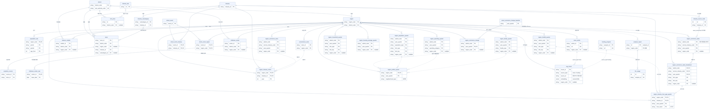

<header class="erd-header">
  
METABOLE / DATA ARCHITECTURE

  
<h1 id="erd-title">데이터 모델 ERD</h1>v3.0 · 구현 기준

  
공공데이터가 분석의 근거가 되기까지. 36개 테이블의 관계와 마스터 → 원천 → 집계·파생 → 검색·에이전트로 이어지는 데이터 흐름을 한눈에 살펴봅니다.

  
PostgreSQL + pgvector스키마 확인 <time datetime="2026-09-23">2026.09.23</time> · 적재 실측 <time datetime="2026-09-28">2026.09.28</time><a href="#erd-changes">변경 이력 ↗</a>

</header>

<nav class="erd-layers" aria-label="데이터 계층별 상세">
  <a class="erd-layer erd-master" href="#erd-master">01 MASTER<strong>마스터 <b>6</b></strong><small>지역·업종의 기준이 되는 허브</small></a>
  <a class="erd-layer erd-source" href="#erd-source">02 SOURCE<strong>원천 <b>24</b></strong><small>인허가·스냅샷·외생 변수·서울 상권분석</small></a>
  <a class="erd-layer erd-metric" href="#erd-serving">03 METRICS<strong>집계·파생 <b>3</b></strong><small>업종 지표 · 동네 유형 · 시간대 어긋남</small></a>
  <a class="erd-layer erd-search" href="#erd-agent">04 SEARCH · AGENT<strong>검색·에이전트 <b>3</b></strong><small>RAG 청크 · 분석 리포트 · 토큰 사용량</small></a>
</nav>

<nav class="erd-jumpnav" aria-label="ERD 페이지 목차">
  <a href="#erd-overview">전체 관계도</a><a href="#erd-master">마스터</a><a href="#erd-source">인허가</a><a href="#erd-snapshot">스냅샷</a><a href="#erd-external">외생 변수</a><a href="#erd-commerce">업종 실적</a><a href="#erd-neighborhood">동네 맥락</a><a href="#erd-serving">집계·파생</a><a href="#erd-agent">검색·에이전트</a><a href="#erd-validation">설계 검증</a><a href="#erd-changes">변경 이력</a>
</nav>

문서 기준과 설계 원칙 실DB 스키마 · 정규화 · Fractal 11-File Set

운영 DB의 `information_schema`(컬럼·PK·UK·FK)를 직접 조회해 옮겼다. 문서와 DB가 어긋나면 DB가 맞다. v1.0(Sprint 1)은 MVP 15테이블 설계 초안, v2.0(09.17)은 21테이블 구현본이며, v3.0(09.23)은 서울 상권분석서비스 계열 11테이블·파생 2테이블·에이전트 2테이블을 더한 36테이블이다. 초안 대비 변경분은 [§11](#erd-changes)에 정리했다.

1. **1NF→3NF 정규화.** 역정규화는 집계·파생 계층에만 허용하고 근거를 남긴다.
2. **고립 테이블 금지.** 모든 테이블은 마스터 허브(`district`·`region`·`industry`)까지 FK 경로가 있어야 한다. 구현상의 예외는 [§10](#erd-validation)에 기록했다.
3. **1 테이블 = 1 Fractal 11-File Set = 1 AI 위임 단위.** [개발 표준 및 산출물]({{ '/docs/guidelines/standards.html' | relative_url }})

## 1. 전체 관계도
{: #erd-overview }

키 컬럼(PK·FK·UK)을 중심으로 테이블 간 연결을 표시했다. 전체 컬럼과 설계 근거는 아래 계층별 명세에서 확인할 수 있다. 실선은 DB 외래키 제약, 점선은 애플리케이션 레벨 관계(배치 집계·다형 참조·코드 매핑)다.

<section class="erd-diagram" aria-label="전체 ERD 다이어그램" markdown="1">

  
<strong>Schema explorer</strong>36 tables

  

    <button type="button" data-erd-action="out" aria-label="다이어그램 축소" title="축소">−</button>
    <output class="erd-zoom" aria-live="polite" aria-label="다이어그램 배율">100%</output>
    <button type="button" data-erd-action="in" aria-label="다이어그램 확대" title="확대">+</button>
    <button type="button" data-erd-action="actual">실제 크기</button>
    <button type="button" data-erd-action="fit">화면에 맞추기</button>
    <button type="button" data-erd-action="expand" aria-pressed="false">크게 보기</button>
  

```mermaid
%%{init: {"theme": "base", "themeVariables": {"fontFamily": "Pretendard, sans-serif", "primaryColor": "#f0f5ff", "primaryTextColor": "#253952", "primaryBorderColor": "#96afcb", "lineColor": "#8093ac", "tertiaryColor": "#f8fafc"}, "er": {"useMaxWidth": false, "layoutDirection": "LR"}}}%%
erDiagram
    %% ── 마스터 계층 ──
    district ||--o{ region : "포함"
    region ||--o{ population_stat : "인구"
    industry ||--o{ industry_subcategory : "세분"
    industry ||--o{ industry_source_code : "코드매핑"

    %% ── 원천 계층: 인허가 ──
    district ||--o{ store : "관할"
    region |o--o{ store : "위치"
    industry ||--o{ store : "업종"
    industry_subcategory |o--o{ store : "서브카테고리"
    store ||--o{ academy_course : "교습과정"
    district ||--o{ tobacco_retailer : "지정관할"
    region |o--o{ tobacco_retailer : "위치"

    %% ── 원천 계층: 스냅샷 ──
    region ||--o{ convenience_store : "수집 단위"
    district ||--o{ childcare_center : "수집 단위"
    region |o--o{ childcare_center : "위치"
    childcare_center ||--o{ childcare_center_stat : "기준일별 현황"

    %% ── 원천 계층: 외생 변수 ──
    district |o--o{ rent_price : "매핑 후속"
    interest_rate }o..o{ rent_price : "계산기 조인"
    shock_event ||--o{ shock_event_industry : ""
    industry ||--o{ shock_event_industry : ""
    shock_event ||--o{ shock_event_region : ""
    region ||--o{ shock_event_region : ""
    region |o--o{ news_article : "관련지역"

    %% ── 원천 계층: 서울 상권분석서비스 — 업종 실적 (commerce) ──
    region |o--o{ region_commerce_sales : "옛 행정동 3개 NULL"
    region |o--o{ region_commerce_store : ""
    region |o--o{ region_commerce_sales_breakdown : ""
    region_commerce_sales ||--o{ region_commerce_sales_breakdown : "복합 FK"
    industry_source_code }o..o{ region_commerce_sales : "seoul_commercial 코드매핑"

    %% ── 원천 계층: 서울 상권분석서비스 — 동네 맥락 (neighborhood) ──
    region |o--o{ region_footfall_quarter : ""
    region |o--o{ region_population_quarter : ""
    region |o--o{ region_household_quarter : ""
    region |o--o{ region_housing_average_quarter : ""
    region |o--o{ region_facility_quarter : ""
    region |o--o{ region_spending_quarter : ""
    region |o--o{ region_commerce_change : ""
    seoul_commerce_change_baseline ||--o{ region_commerce_change : "분기 기준선"

    %% ── 집계·파생 계층 ──
    region ||--o{ region_industry_metric : ""
    industry ||--o{ region_industry_metric : ""
    store ||..o{ region_industry_metric : "개폐업 집계"
    convenience_store ||..o{ region_industry_metric : "점포수"
    childcare_center ||..o{ region_industry_metric : "점포수"
    region ||--o{ region_profile_quarter : ""
    region ||--o{ region_industry_hour_gap_quarter : ""
    industry ||--o{ region_industry_hour_gap_quarter : ""
    region_footfall_quarter ||..o{ region_profile_quarter : "4분기 평활 판정"
    region_population_quarter ||..o{ region_profile_quarter : ""
    region_spending_quarter ||..o{ region_profile_quarter : ""
    region_facility_quarter ||..o{ region_profile_quarter : ""
    region_footfall_quarter ||..o{ region_industry_hour_gap_quarter : "시간 강도"
    region_commerce_sales_breakdown ||..o{ region_industry_hour_gap_quarter : "시간 강도"

    %% ── 검색·에이전트 계층 ──
    region |o--o{ rag_chunk : "지역 필터"
    news_article ||..o{ rag_chunk : "source_type=news"
    funding_program ||..o{ rag_chunk : "source_type=funding"
    analysis_report ||--o{ llm_usage : "턴별 토큰"
    region |o..o{ analysis_report : "FK 없음"

    district {
        string district_code PK
        string opn_authority_code UK
    }
    region {
        string region_code PK
        string district_code FK
    }
    population_stat {
        string region_code PK, FK
        string period PK
        string gender PK
        int age_from PK
    }
    industry {
        string industry_id PK
    }
    industry_subcategory {
        string subcategory_id PK
        string industry_id FK
    }
    industry_source_code {
        int id PK
        string industry_id FK
    }
    store {
        string store_id PK
        string district_code FK
        string region_code FK "nullable"
        string industry_id FK
        string subcategory_id FK "nullable"
    }
    academy_course {
        string course_id PK
        string store_id FK
    }
    tobacco_retailer {
        string retailer_id PK
        string district_code FK
        string region_code FK "nullable"
    }
    convenience_store {
        string store_id PK
        string region_code FK
    }
    childcare_center {
        string center_id PK
        string district_code FK
        string region_code FK "nullable"
    }
    childcare_center_stat {
        string center_id PK, FK
        date base_date PK
    }
    rent_price {
        string id PK
        string district_code FK "nullable"
    }
    interest_rate {
        string id PK
    }
    shock_event {
        string event_id PK
    }
    shock_event_industry {
        string event_id PK, FK
        string industry_id PK, FK
    }
    shock_event_region {
        string event_id PK, FK
        string region_code PK, FK
    }
    news_article {
        string article_id PK
        string url UK
        string region_code FK "nullable"
    }
    funding_program {
        string program_id PK
        string url UK
    }
    region_commerce_sales {
        string adstrd_code PK "원천 행정동 8자리"
        string service_industry_code PK
        string year_quarter PK
        string region_code FK "nullable"
    }
    region_commerce_store {
        string adstrd_code PK
        string service_industry_code PK
        string year_quarter PK
        string region_code FK "nullable"
    }
    region_commerce_sales_breakdown {
        string adstrd_code PK, FK
        string service_industry_code PK, FK
        string year_quarter PK, FK
        string dim_type PK
        string dim_key PK
        string region_code FK "nullable"
    }
    region_footfall_quarter {
        string adstrd_code PK
        string year_quarter PK
        string dim_type PK
        string dim_key PK
        string region_code FK "nullable"
    }
    region_population_quarter {
        string adstrd_code PK
        string year_quarter PK
        string population_type PK
        string dim_type PK
        string dim_key PK
        string region_code FK "nullable"
    }
    region_household_quarter {
        string adstrd_code PK
        string year_quarter PK
        string dim_type PK
        string dim_key PK
        string region_code FK "nullable"
    }
    region_housing_average_quarter {
        string adstrd_code PK
        string year_quarter PK
        string region_code FK "nullable"
    }
    region_facility_quarter {
        string adstrd_code PK
        string year_quarter PK
        string facility_type PK
        string region_code FK "nullable"
    }
    region_spending_quarter {
        string adstrd_code PK
        string year_quarter PK
        string spending_category PK
        string region_code FK "nullable"
    }
    seoul_commerce_change_baseline {
        string year_quarter PK
    }
    region_commerce_change {
        string adstrd_code PK
        string year_quarter PK, FK
        string region_code FK "nullable"
    }
    region_industry_metric {
        string region_code PK, FK
        string industry_id PK, FK
        int year PK
    }
    region_profile_quarter {
        string region_code PK, FK
        string year_quarter PK
        string neighborhood_type "6유형"
    }
    region_industry_hour_gap_quarter {
        string region_code PK, FK
        string industry_id PK, FK
        string year_quarter PK
        string hour_band PK "6구간"
    }
    rag_chunk {
        string chunk_id PK
        string source_type "news / funding"
        string source_id "원천 PK 다형 참조"
        vector embedding "vector(1536)"
        string region_code FK "nullable"
    }
    analysis_report {
        string id PK "analysis_id"
        string region_code "FK 없음"
    }
    llm_usage {
        int id PK
        string analysis_id FK
    }
```

<i class="erd-line" aria-hidden="true"></i> DB 외래키 관계<i class="erd-line erd-line-dashed" aria-hidden="true"></i> 애플리케이션 관계확대 후 스크롤로 탐색 · 상세 컬럼은 아래 명세 참고

</section>

한 줄 요약: **`region`·`district`·`industry`가 모든 엣지가 모이는 허브이고, 서비스 조회는 지도의 `region_industry_metric`·`region_profile_quarter`·`region_commerce_change`, AI 검색의 `rag_chunk`로 모인다.** 원천 테이블은 3NF를 엄격히 지키고, 역정규화는 집계·파생 계층에만 둔다. 서울 상권분석서비스 계열 11테이블이 전체 약 1,159만 행의 86%(약 999만 행)를 차지하고, 인허가 `store`는 09.28 음식 업종 8종 적재로 34.9만 → 88.8만 행이 됐다.

### 적재 현황 (2026-09-28, `count(*)` 실측 — 음식 업종 24구 적재 반영, 총 약 1,159만 행)

| 계층 | 테이블 (행 수) |
|---|---|
| 마스터 | district 25 · region 427 · industry **18** · industry_subcategory 8 · industry_source_code **32** · population_stat 142,632 |
| 원천(인허가) | store **888,308**(영업 258,773 · 폐업 629,535, 음식 8종 539,112) · academy_course 64,716 · tobacco_retailer 95,402 |
| 원천(스냅샷) | convenience_store 9,395 · childcare_center 3,940 · childcare_center_stat 11,819(스냅샷 3회) |
| 원천(외생 변수) | rent_price 3,638 · interest_rate 365 · shock_event 26 · shock_event_industry 107 · shock_event_region **0** · news_article 5,970 · funding_program 2,068 |
| 원천(상권분석 — 업종 실적) | region_commerce_sales 343,167 · region_commerce_store 704,470 · region_commerce_sales_breakdown **7,892,841** |
| 원천(상권분석 — 동네 맥락) | region_footfall_quarter 205,700 · region_population_quarter 387,618 · region_household_quarter 149,353 · region_housing_average_quarter 9,331 · region_facility_quarter 187,000 · region_spending_quarter 102,850 · region_commerce_change 9,350 · seoul_commerce_change_baseline 22 |
| 집계·파생 | region_industry_metric **55,093**(18업종, 음식 27,264 추가) · region_profile_quarter 9,284 · region_industry_hour_gap_quarter 342,078 |
| 검색 | rag_chunk 7,980 (news 5,912 · funding 2,068, 전건 fp16 임베딩) |
| 에이전트 | analysis_report 22 · llm_usage 22 |

---

## 2. 마스터 계층 — 모든 엣지가 모이는 허브
{: #erd-master }

변화가 거의 없는 기준 데이터다. 원천 테이블은 이 허브에 FK로 연결되어 고립 테이블·고아 컬럼이 생기지 않는다.

| 테이블 | 컬럼 | 비고 |
|---|---|---|
| `district` | district_code(PK), name, opn_authority_code(UQ, nullable) | 서울 25개 자치구. opn_authority_code는 인허가 원천의 개방자치단체코드 매핑용 |
| `region` | region_code(PK), district_code(FK), name, geometry_ref(nullable) | 행정동 427개. geometry_ref는 경계 GeoJSON 경로 |
| `population_stat` | region_code(FK)+period+gender+age_from(복합 PK), age_to(nullable), population | 주민등록 인구. period는 YYYYMM, 5세 구간이며 100세 이상은 age_to가 NULL. 성별 계는 합산으로 도출 |
| `industry` | industry_id(PK), name, demand_type | 업종 18종 — 기존 10종 + 09.28 음식 8종(한식·중식·일식·양식·분식·호프주점·치킨·`restaurant_other` 비노출). demand_type은 수요동인 4유형. 화면 판정 대상은 14종(학원·어린이집은 보조축) |
| `industry_subcategory` | subcategory_id(PK), industry_id(FK), category_axis, target_group(nullable) | 교습계열·미용 세분 같은 업종 내부 분류 축 |
| `industry_source_code` | id(PK), industry_id(FK), source_system, code · UQ(industry_id, source_system, code) | 원천 시스템(LOCALDATA·NEIS·상가정보·서울 상권분석 `seoul_commercial`)별 업종코드 매핑. 상권분석 코드는 cafe에 패스트푸드, hair_salon에 네일·피부를 더한 매핑. 09.28 인허가 `general_restaurants` 앵커 1행·상권분석 음식 7행을 더하고 cafe↔분식(CS100008)을 빼 32행 |

- **1NF:** 인구의 연령대별 수치는 `age_10, age_20…` 컬럼이 아니라 행 단위로 둔다. 업종 1개가 원천 코드를 여러 개 가지는 경우(예: 편의점 = 담배소매인 + 상가정보 코드, 카페 = 상권분석 3코드)도 `industry_source_code`로 분리했다.
- **3NF:** `region`에 자치구명을 두면 이행 종속이 생기므로 `district`를 별도 테이블로 뺐다. 표본이 얇은 업종(노래방·당구장 등)을 자치구 단위로 집계하는 축으로도 쓴다.

## 3. 원천 계층 — 인허가
{: #erd-source }

지자체 인허가 데이터로, 개업일·폐업일이 있어 개폐업 시계열 분석의 원천이 된다.

| 테이블 | 컬럼 | 비고 |
|---|---|---|
| `store` | store_id(PK), name, industry_id(FK), district_code(FK), region_code(FK, nullable), subcategory_id(FK, nullable), open_date, close_date, status_code, status_name, lat, lng, source_updated_at | LOCALDATA 인허가 업종 점포. store_id는 관리번호(MNG_NO). 좌표는 EPSG:5174→WGS84로 변환하고, region_code는 행정동 경계 공간조인 후 채운다. 학원·부동산중개처럼 좌표가 없는 행은 SGIS 지오코딩으로 보완(학원 99.8%·부동산 99.5%). source_updated_at은 증분 수집 커서 |
| `academy_course` | course_id(PK), store_id(FK), course_name, tuition_fee(nullable), target_grade(nullable) | 학원 교습과정·수강료(OA-20528). course_id = store_id:연번. target_grade는 LLM 추출 후속으로 현재 NULL |
| `tobacco_retailer` | retailer_id(PK), name, district_code(FK), region_code(FK, nullable), status_code, status_name, designated_date, permit_date, close_date, cancel_date, lat, lng, road_address, jibun_address, source_updated_at | 담배소매인 지정(인허가 아카이브 CSV). 편의점은 단일 인허가 코드가 없어 지정 여부가 사실상 출점 가능 여부를 정한다 |

- **nullable FK는 의도된 미연결만 허용한다.** `region_code`가 비어 있는 행은 좌표 결측이거나 공간조인 전인 경우다. 그래서 관할 자치구는 원천 코드로 `district_code`(NOT NULL)에 따로 보관한다.
- **`tobacco_retailer`를 `store`에 합치지 않은 이유:** 담배소매인은 점포(업종)가 아니라 지정 권리다. 편의점·슈퍼·가판이 섞여 industry FK가 성립하지 않고, 지정일·취소일처럼 컬럼 축도 다르다.
- **학원 폐업률은 값이 아니다.** 서울 학원 API는 폐원일자를 주지 않아 `close_date`가 전부 NULL이다. 집계는 이를 폐업 0으로 세지 않고 스냅샷 원천과 같은 규칙(폐업 이력 없음 → NULL)으로 다룬다.

## 4. 원천 계층 — 스냅샷
{: #erd-snapshot }

원천 API가 "현재 영업 중인 시설"만 돌려주는 데이터다. 폐업 이력이 없으므로 관측일(`first_seen_on`·`last_seen_on`)을 남겨 소실(폐점 추정 후보)을 추적한다.

| 테이블 | 컬럼 | 비고 |
|---|---|---|
| `convenience_store` | store_id(PK), name, branch_name, brand, region_code(FK), lat, lng, road_address, jibun_address, source_stdr_ym, first_seen_on, last_seen_on | 소진공 상가정보 체인화 편의점(G20405) × 행정동 427회 수집. store_id는 상가업소번호(bizesId). brand는 상호에서 추출(GS25·CU·세븐일레븐·이마트24·미니스톱) |
| `childcare_center` | center_id(PK), name, type_name, status_name(nullable), district_code(FK), region_code(FK, nullable), address, zipcode, tel, lat, lng, approved_on, paused_from, paused_until, abolished_on, first_seen_on, last_seen_on | 어린이집정보공개포털 cpmsapi030 × 자치구 25회 수집. 좌표가 등록 자치구 밖이면 좌표 오류로 보고 region_code를 채우지 않는다. 대표자명은 개인 실명이라 수집하지 않음 |
| `childcare_center_stat` | center_id(FK)+base_date(복합 PK), capacity, child_count, waiting_count(nullable), class_count, staff_count | 기준일별 정원·현원·입소대기·반 수·보육교직원 수. 주간 수집 크론으로 기준일이 쌓인다(7,880행 = 2회 관측). 입소대기 공란은 NULL로 보존 |

- **`store`에 합치지 않은 이유:** 스냅샷 원천에는 개폐업 이력이 없다. `store`에 섞으면 `region_industry_metric`의 개업·폐업 지표가 오염된다. 편의점 개폐업 이력은 `tobacco_retailer`가 맡는다.
- **시설/현황 분리 (2NF·이력):** 정원·현원·대기는 (시설, 기준일)에 종속되고 시점마다 변한다. 시설 행에 덮어쓰면 가동률 추이를 되살릴 수 없어서 기준일별 이력 행으로 분리했다.
- **3NF:** `convenience_store`는 수집 단위가 행정동이라 `district_code`를 두지 않는다(region 경유 이행 종속). 원천의 시도명·시군구명도 같은 이유로 버린다.
- **1NF:** 연령별 반·아동·대기 수, 교직원 직종·근속 분포는 컬럼 나열이 되므로 이번에는 수집하지 않았다. 쓰는 곳이 생기면 행 단위 테이블로 추가한다.

## 5. 원천 계층 — 외생 변수
{: #erd-external }

상권 밖에서 들어오는 변수(임대료·금리·특이 이벤트·뉴스·정책자금)다.

| 테이블 | 컬럼 | 비고 |
|---|---|---|
| `rent_price` | id(PK), building_type, cls_id, region_name, region_path, region_level, district_code(FK, nullable), period, rent_per_m2, vacancy_rate, rent_statbl_id, vacancy_statbl_id | R-ONE 임대동향조사. id = building_type:cls_id:period, period는 YYYYQn. 원천 지역 단위가 자치구가 아니라 상권·권역·시도라서 원천 지역명을 보존하고 district_code는 매핑표 구축 후 채운다. 계획 화면의 임대료 프리필은 권역 근사로 읽는다. statbl_id로 표본 개편(빈티지)을 추적 |
| `interest_rate` | id(PK), rate_type, period, rate, unit, stat_code, item_code | 한국은행 ECOS 시계열. id = rate_type:period, period는 YYYYMM. 금융 계산기·계획 프리필 전용이라 region/industry FK가 없다(§10) |
| `shock_event` | event_id(PK), layer, name, start_date, end_date(nullable), scope, source, source_url(nullable), description(nullable) | 특이변수 4계층(①정책 ②거시 ③트렌드 ④지역). scope는 전국·서울·지역 |
| `shock_event_industry` | event_id(FK)+industry_id(FK)(복합 PK), severity | 이벤트↔업종 M:N. 업종별 severity를 함께 기록 |
| `shock_event_region` | event_id(FK)+region_code(FK)(복합 PK) | 이벤트↔행정동 M:N. 테이블·FK는 있으나 적재 0건 |
| `news_article` | article_id(PK), title, description, published_at, url(UQ), matched_keyword, press(nullable), region_code(FK, nullable) | 네이버 뉴스. article_id = sha1(url) 20자리. description은 발췌만 저장하고 본문은 저장하지 않는다. matched_keyword는 수집 키워드일 뿐 지역 신호가 아니다. press는 네이버 응답에 언론사명이 없어 nullable |
| `funding_program` | program_id(PK), source, title, org, url(UQ), apply_period, exec_org, field_category, field_subcategory, target_text, hashtags, apply_begin, deadline, summary, posted_at, source_updated_at, is_expired | 기업마당 정책자금 공고. summary는 발췌만 저장하고 원문 링크(url)는 필수. deadline은 상시 공고면 NULL, is_expired는 일 배치로 갱신 |

- **정정 이력:** 초안의 `rent_price.sale_price_avg`(실거래 매매 평균)는 실데이터 확인 전이라 컬럼을 유보했다. `interest_rate`의 은행군·신용등급 컬럼은 은행연합회 공시의 축이라 ECOS 시계열과 섞지 않고, 후속 수집 시 별도 테이블로 둔다.
- **`news_article.event_id`:** 기사를 `shock_event`로 승격하는 기능을 만들 때 컬럼과 FK를 함께 추가한다(구현 유보).

## 6. 원천 계층 — 서울 상권분석서비스 · 업종 실적 (commerce)
{: #erd-commerce }

서울시 상권분석서비스 공개 CSV(공공누리 1유형, API 호출 없음)의 행정동 계열 중 **업종 축이 있는** 데이터다. 행정동 × 서비스업종 × 분기가 사실 단위이며 2021Q1~2025Q4 20분기에 결측이 없다.

| 테이블 | 컬럼 | 비고 |
|---|---|---|
| `region_commerce_sales` | adstrd_code+service_industry_code+year_quarter(복합 PK), region_code(FK, nullable), sales_amount, sales_count | 추정매출(OA-22175). 원천 8자리 행정동 코드는 `region` 10자리의 앞 8자리와 1:1(충돌 0건). 계획 화면의 월매출 프리필 = sales ÷ store ÷ 3 |
| `region_commerce_store` | 같은 복합 PK, region_code(FK, nullable), store_count, similar_industry_store_count, open_rate, open_store_count, close_rate, close_store_count, franchise_store_count | 점포(OA-22172). 교차검증 결과 상권분석 `점포_수`는 인허가 총 점포수와 다른 개념이라 우리 인허가 모집단과 나란히 놓지 않는다 |
| `region_commerce_sales_breakdown` | 부모 3키+dim_type+dim_key(복합 PK), 부모와 복합 FK, region_code(FK, nullable), amount, count | 매출 분해 47컬럼을 1NF long 테이블로(dim_type 5축 weekpart·dow·hour·gender·age × 23구간). 7,892,841행. weekpart·dow·hour는 총액의 완전 분할이지만 **gender·age는 금액의 89.2%만 덮어** 구성비로만 쓴다 |

- **`industry_id`를 사실 테이블에 박지 않았다.** 원천 서비스업종 코드를 PK로 보존하고 `industry_source_code`(`source_system='seoul_commercial'`)로 조인한다. cafe·hair_salon 매핑이 바뀌어도 70만 행을 재적재하지 않는다.
- **옛 행정동 3개는 버리지 않는다.** 원천에만 있는 용신동·일원2동·상일동은 `region_code` NULL로 적재(0.63%)하고, 조회 시 `region_code IS NOT NULL`을 원칙으로 한다. 상권분석 11테이블의 `region_code`가 모두 nullable인 이유다.
- **순서 기반 컬럼 매핑.** 원천 헤더에 오타(`시간대_건수~06_매출_건수`)가 있어 이름이 아니라 순서로 매핑하고, 어긋나면 즉시 실패시킨다.

## 7. 원천 계층 — 서울 상권분석서비스 · 동네 맥락 (neighborhood)
{: #erd-neighborhood }

같은 상권분석서비스에서 **업종 축이 없는** 분기 × 행정동 데이터다. 어휘가 다르고 합치면 한 BC가 10테이블이 되어 컨텍스트 단위가 무너지므로 commerce와 BC를 갈랐다. 22분기(2021Q1~2026Q2)가 연속으로 있다.

| 테이블 | 컬럼 | 비고 |
|---|---|---|
| `region_footfall_quarter` | adstrd_code+year_quarter+dim_type+dim_key(복합 PK), region_code(FK, nullable), headcount | 길단위 유동인구. dim_type은 total·gender·age·hour·dow |
| `region_population_quarter` | adstrd_code+year_quarter+population_type+dim_type+dim_key(복합 PK), region_code(FK, nullable), headcount | 직장(worker)·상주(resident) 인구. 값 컬럼 21개가 동일해 한 테이블에 population_type으로 구분. 직장인구는 425개 동 중 11개 결측 |
| `region_household_quarter` | adstrd_code+year_quarter+dim_type+dim_key(복합 PK), region_code(FK, nullable), value | 가구·아파트(household·apartment_complex·area·price). 아파트 가구수는 원천이 전행 0 |
| `region_housing_average_quarter` | adstrd_code+year_quarter(복합 PK), region_code(FK, nullable), avg_area_m2, avg_price | 주거 평균 면적·시가. 편차가 극단적이라 절대값 서술 금지 |
| `region_facility_quarter` | adstrd_code+year_quarter+facility_type(복합 PK), region_code(FK, nullable), facility_count | 집객시설 total + 19종. **total은 19종 합이 아니다**(커버리지 48.4%) → 나란히 놓지 않는다. 철도역 수는 NULL 100% |
| `region_spending_quarter` | adstrd_code+year_quarter+spending_category(복합 PK), region_code(FK, nullable), amount | 지출 total + 10종(가맹점 결제, 발생지 기준). 원천 CSV는 `음식`이 `기타` 뒤에 와서 순서 매핑이면 통째로 뒤바뀌므로 이름 매핑으로 적재. 유입·유출 지수는 정의상 성립하지 않아 폐기하고 구성비만 조건부 사용 |
| `region_commerce_change` | adstrd_code+year_quarter(복합 PK), year_quarter(FK → baseline), region_code(FK, nullable), change_code(HH·HL·LH·LL), change_name, operating_months, closed_months | 상권 변화 지표(영업 지속 개월·폐업 영업 개월). change_name은 change_code에 함수종속인 역정규화(근거 명시) |
| `seoul_commerce_change_baseline` | year_quarter(PK), seoul_operating_months, seoul_closed_months | 서울 평균은 분기에만 종속이라 **2NF 분리** 후 FK로 노드화. 지도 상세 화면의 "서울 118개월" 비교 기준 |

- **실데이터 함정을 테스트로 고정했다.** 지출 항목 순서, 집객시설 total 불일치, 직장인구 결측 11개 동은 적재 테스트가 재현한다.
- **값 없는 동은 행을 만들지 않는다.** 0으로 채우면 지도에서 "가장 빨리 닫는 동네"로 색칠되므로, 조회 API는 결측 동을 응답에서 뺀다.

## 8. 집계 · 파생 계층 — 서비스 조회용
{: #erd-serving }

원천이 진실이고 이 계층은 배치로 다시 만들 수 있다. 불일치가 생기면 배치 재실행으로 복구한다(재실행 멱등).

| 테이블 | 컬럼 | 비고 |
|---|---|---|
| `region_industry_metric` | region_code(FK)+industry_id(FK)+year(복합 PK), store_count, open_count(nullable), close_count(nullable), closure_rate(nullable), growth_rate(nullable) | 행정동×업종×연도 사전 집계. 지도 업종 무리(폐업률·성장률·점포수)와 요약 카드의 원천. 폐업 이력이 없는 원천(어린이집·편의점·학원)은 open/close 계열이 NULL |
| `region_profile_quarter` | region_code(FK)+year_quarter(복합 PK), neighborhood_type, type_reason, time_label, peak_block, trough_block, worker_resident_ratio, weekend_index, night_index, footfall_20s_share, fnb_share, facility_total, resident_total, 4블록 강도 컬럼 | **동네 유형 6종**(주거·먹자/나들이·업무(낮 인구 우위)·대학가·생활중심·혼합) 판정과 근거 문장. 임계값은 매 배치 분포에서 재계산하고 판정 창은 최근 4분기 이동평균(22분기 유형 불변 80.1%). 규칙 객체 7개 리스트(Chain of Responsibility). 9,284행·33초 |
| `region_industry_hour_gap_quarter` | region_code(FK)+industry_id(FK)+year_quarter+hour_band(복합 PK), footfall_intensity, sales_intensity, gap | **시간대 어긋남**. 6구간 길이가 6·5·3·3·4·3시간으로 달라 시간당 강도(1.0 = 24시간 균등)로 보정. gap의 부호는 절대값이 아니라 유형 간 상대 순위로 읽는다. 342,078행 |

- **파생 2종의 원천은 neighborhood·commerce다.** `apps/metric`이 게이트웨이로 읽어 계산하며 행 단위 참조가 아니라 DB FK를 걸지 않는다(점선).
- **지도 지표 계약은 테이블 수가 아니라 화면 수요를 따른다.** 단계구분도 `{region_code, value}`와 상세 두 벌뿐이며, 파생 7종은 extractor 테이블 한 줄씩으로 열린다.

## 9. 검색 · 에이전트 계층
{: #erd-agent }

| 테이블 | 컬럼 | 비고 |
|---|---|---|
| `rag_chunk` | chunk_id(PK), source_type, source_id, content, embedding(vector 1536, nullable), embedded_by(nullable), published_at, org, url, region_code(FK, nullable) · IX(source_type, source_id) | RAG 검색 청크(pgvector, HNSW 인덱스). source_type에 따라 `news_article` 또는 `funding_program`의 PK를 가리킨다. embedded_by에 임베딩 모델명을 남겨 색인 모델 혼용을 추적. 전량 fp16 색인. 평가셋 confirmed 180건 기준 Hit@5 1.000·MRR 0.95 |
| `analysis_report` | id(PK, analysis_id UUID), region_code, industry, question(nullable), report_md, citations_json, model, created_at | AI 분석 SSE 스트림이 완료될 때 1행. 리포트는 지역이 삭제돼도 남아야 하는 이력 데이터라 `region_code`에 FK를 걸지 않는다 |
| `llm_usage` | id(PK), analysis_id(FK), model, input_tokens, output_tokens, latency_ms, created_at | 리포트별 토큰 사용량·지연. 두뇌 혼합(Gemini 우선·로컬 폴백) 비용 추적 |

- **검색 표현과 원천을 분리했다.** 청킹 전략이나 임베딩 모델이 바뀌어도 원천 테이블은 그대로 두고 `rag_chunk`만 다시 만든다.
- **테이블 없는 BC도 있다.** 관문 파서(intent)와 재무 계산(finance)은 상태가 없어 ERD에 테이블이 없다 — "1 테이블 = 1 프랙탈" 원칙의 의도적 예외다.

---

## 10. 역정규화 · 고립 테이블 검증
{: #erd-validation }

**역정규화 현황 (근거 명시):**

| 위치 | 내용 | 근거 |
|---|---|---|
| `region_industry_metric` 테이블 전체 | `store`에서 계산 가능한 집계를 사전 저장 | 지도 API가 요청마다 수십만 행을 집계하면 응답 지연 목표(-40%)를 맞출 수 없다. 일 1회 배치로 신선도는 충분 |
| `region_profile_quarter`·`region_industry_hour_gap_quarter` | neighborhood·commerce 원천에서 유도 가능한 파생 지표 | 유형 판정은 매 배치 전 동 분포로 임계값을 재계산해야 하므로 요청 시 계산이 불가능. 배치 재실행 멱등 |
| `region_commerce_change.change_name` | change_code에 함수종속 | 화면 라벨을 조인 없이 읽기 위한 것. 코드 → 이름 표를 함께 보관 |
| `store.status_code`·`status_name` | open_date/close_date에서 유도 가능 | 상태 필터 쿼리 빈도가 압도적이라 인덱스를 건 상태 컬럼 유지 |
| `convenience_store.brand` | 상호(name)에서 추출 가능 | 브랜드 분포 조회 축. 원본 상호를 보존하므로 언제든 재추출 가능 |
| 상권분석 11테이블의 `region_code` | adstrd_code에서 유도 가능(앞 8자리 1:1) | `region` 조인 키를 미리 채워 두되, 원천에만 있는 옛 행정동은 NULL로 보존 |
| `interest_rate` ↔ 지표 테이블 비연결 | 계산기 전용 독립 시계열 | 상권과 무관한 전국 공시 데이터. 계산기·계획 프리필 UseCase에서 `rent_price`와 애플리케이션 조인 |

리뷰에서 반려하는 역정규화 예: `store`에 행정동명 저장, 지표 테이블에 업종명 저장, 상권분석 사실 테이블에 `industry_id` 저장. JOIN 한 번으로 해결되는 것은 역정규화 사유가 아니다.

**점선(애플리케이션 레벨) 엣지 사유:**
- `rag_chunk.source_id` — source_type에 따라 가리키는 테이블이 달라지는 다형 참조라 단일 FK 제약을 걸 수 없다.
- `region_industry_metric` ← `store`·`convenience_store`·`childcare_center`, `region_profile_quarter`·`region_industry_hour_gap_quarter` ← neighborhood·commerce — 배치 집계로 생기는 파생 관계이고 행 단위 참조가 아니다.
- `industry_source_code` ↔ `region_commerce_sales` — 원천 서비스업종 코드를 PK로 보존해야 하므로 FK 대신 `source_system='seoul_commercial'` 행을 경유한다.
- `analysis_report.region_code` — 이력 데이터라 지역 삭제에 영향받지 않도록 FK 없음.
- `interest_rate` ↔ `rent_price` — 위 역정규화 표의 계산기 앱 조인.

**고립 테이블 검증 (DB FK 기준):** 36테이블 중 32개는 마스터 허브까지 DB FK 경로가 있다. 예외는 다음과 같다.
- `funding_program` — DB FK가 하나도 없고 `rag_chunk` 다형 참조로만 이어진다. 업종 허브와 잇는 `funding_program_industry`가 미구현이라 **후속 구현 대상**이다.
- `interest_rate` — DB FK 없음. 위 역정규화 표에 근거를 둔 의도된 예외다.
- `analysis_report`·`llm_usage` — 에이전트 이력 한 묶음. `llm_usage → analysis_report` FK만 있고 허브로는 닿지 않는다(의도된 예외).

그 밖에 `shock_event_region`은 테이블과 FK는 있지만 적재가 0건이고, `tobacco_retailer`는 데이터만 있고 소비처가 없다(편의점 대체 산출을 하지 않기로 결정).

---

## 11. 설계 초안 대비 구현 변경분
{: #erd-changes }

| 구분 | 내용 | 사유 |
|---|---|---|
| **예정 (v3.1, `feat/verdict-card` 미병합)** | verdict 1 — `region_industry_verdict` | 네거티브 판정 카드의 새벽 배치 테이블(동×업종 판정·신호 JSON). 지도가 427동을 한 번에 칠하므로 요청 시 계산 대신 배치. 마이그레이션 `c9d0e1f2a3b4`는 브랜치에만 있고 main 병합 시 37테이블 |
| **변경 (09.28)** | `industry` 8행 추가(한식·중식·일식·양식·분식·호프주점·치킨·restaurant_other), `industry_source_code` 인허가 `general_restaurants` 앵커 1행·상권분석 음식 7행 추가, cafe↔CS100008(분식) 삭제 → 32행 | 음식 업종 확장(BE v0.39.0, 마이그레이션 `b7c8d9e0f1a2`). 인허가 일반음식점은 슬러그 1개로 수집하고 업태(`BZSTAT_SE_NM`) 분류기가 업종을 정한다. 이후 store 888,308행·지표 55,093행 |
| **신규 (v3.0, 09.23)** | commerce 3 — `region_commerce_sales`·`region_commerce_store`·`region_commerce_sales_breakdown` | 서울 상권분석서비스 업종 실적. 초안의 `sales_estimate`(추정매출)는 `region_commerce_sales`로 구현됨 |
| **신규 (v3.0)** | neighborhood 8 — 유동인구·직장/상주인구·가구/아파트·주거 평균·집객시설·지출·상권 변화 + 서울 평균 기준선 | 동네 유형·시간대 서사의 원천. 업종 축이 없어 별도 BC |
| **신규 (v3.0)** | metric 파생 2 — `region_profile_quarter`·`region_industry_hour_gap_quarter` | 동네 유형 6종 판정, 시간대 어긋남 |
| **신규 (v3.0)** | agent 2 — `analysis_report`·`llm_usage` | AI 분석 리포트 영속화(SSE 완료 시 저장)와 토큰 사용량 |
| **신규 (v2.0, 09.17)** | `rag_chunk` | 초안에 없던 검색 계층. RAG 파이프라인 구현(Sprint 2 선행) |
| **신규 (v2.0, 보조)** | `tobacco_retailer` · `convenience_store` · `childcare_center` · `childcare_center_stat` | 편의점 출점 가능 여부, 편의점 분포, 어린이집 시설·기준일별 정원/현원 이력. 개폐업 지표 오염을 막으려고 `store`와 분리 |
| **변경** | `region_industry_metric` — 대리키 `id`·`subcategory_id`·`survival_rate_3y` 제거, `period`(YYYYQ) → `year`(int), PK = (region_code, industry_id, year). 폐업 이력 없는 원천(스냅샷 2종·학원)은 open/close 계열 NULL | 연도 단위 집계, 0을 값처럼 보이지 않게 |
| **변경** | `industry_source_code`에 `seoul_commercial` 16행 추가(cafe 3·hair_salon 3·academy 4 코드 합산) | 상권분석 코드 ↔ 업종 10종 매핑. 교차검증 결과 반영 |
| **변경** | `district.opn_authority_code`(UQ) 추가, `industry_source_code.id`를 int + UQ(industry_id, source_system, code)로 | 인허가 원천 코드 매핑 |
| **변경** | `shock_event.source`·`description`, `shock_event_industry.severity` 추가 | 실구현 시 컬럼 추가 |
| **변경** | `rent_price` 원천 지역명 보존 + district_code nullable, `interest_rate`를 ECOS 시계열 구조로 확정 | 실데이터 확인 결과 반영 (원천 지역 단위·금리 축 차이) |
| **미구현 (이월)** | `funding_program_industry`(공고↔업종 M:N) | 테이블 없음. 공고↔업종 연결은 후속 구현 대상(§10). 조달 화면의 후보 공고 필터는 현재 규칙 기반 |
| **유보** | `news_article.event_id` | shock_event 승격 기능 구현 시 추가 |

---

> **문서 관리:** 본 ERD는 운영 DB 스키마를 기준으로 한다. 테이블·컬럼을 추가하거나 바꾸면 해당 계층 절과 §11 변경분 표를 함께 갱신하고, 새 테이블은 Fractal 11-File Set으로 구현한다. 구현 이력은 [개발 일지]({{ '/docs/devlog.html' | relative_url }})에, 모듈별 구현 방식은 [상세 설계서]({{ '/docs/deliverables/detailed-design.html' | relative_url }})에 있다.

