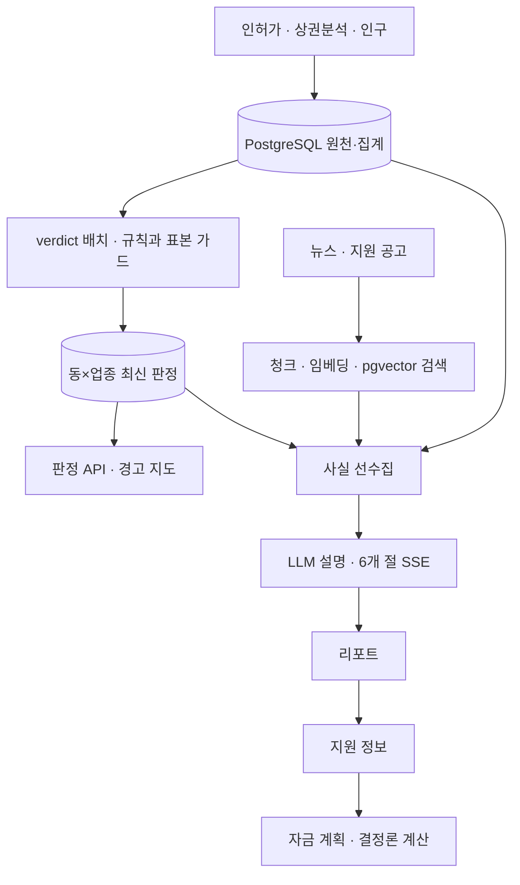

# 시스템 아키텍처

## 데이터 수집 → 판정 → 설명

## 각 계층이 책임지는 것

| 계층 | 책임 | 하지 않는 일 |
|---|---|---|
| 수집·원천 | 자료와 원천 코드·날짜·관측 범위 보존 | 원천 없는 폐업 이력 생성 |
| `verdict` | 신호 평가·상대 백분위·보류·등급·대안 | LLM을 통한 등급 결정 |
| `rag` | 근거 문서 검색·만료 필터·뉴스 사건 접기 | 창업 성공 확률 산출 |
| `agent` | 사실 선수집·설명·스트리밍·리포트 저장 | 계산되지 않은 값을 측정값처럼 작성 |
| `finance` | 사용자 입력과 가정으로 비용·손익 계산 | 대출 승인·신용정보 조회 |
| Next.js | 조건·지도·근거·리포트·지원·계획 표시 | 문서 사이트와 서비스 주소 혼용 |

## 코드 경계와 선택

FastAPI 백엔드는 도메인별 BC와 포트·어댑터 구조를 사용합니다. 판정의 신호는 Specification, 등급은 보류부터 검사하는 규칙 목록, 업종별 원천은 Strategy로 나눕니다. 임계값은 `VerdictThresholds`에서 관리합니다.

Next.js는 `features` 단위로 화면을 나누고 공통 업종·판정 어휘를 `shared`에 둡니다. 브라우저의 `/api/backend/*` 요청은 서버 프록시를 거쳐 백엔드에 전달됩니다. 실제 백엔드 주소는 실행 환경 설정으로 정하며 문서에 비밀값을 넣지 않습니다.

## 지도·검색·모델의 구분

브이월드는 배경지도 타일을 제공합니다. 행정동 경계는 백엔드의 `GET /regions/geojson`, 경고 등급은 `GET /verdicts`로 읽습니다. 지도의 범주 4개와 데이터 없음 상태를 구분합니다.

검색은 코사인 벡터 검색과 정형 필터·뉴스 후처리입니다. 초기 Hybrid RAG 구상과 차이는 [검색 파이프라인]({{ '/docs/requirements/rag-pipeline.html' | relative_url }})에 기록했습니다. HANDOFF에 제안된 생존분석·LightGBM·SHAP은 현재 등급 계산 코드로 소개하지 않습니다.

## 검증과 설계의 이유

[상세 설계서]({{ '/docs/deliverables/detailed-design.html' | relative_url }})에서 사실 선수집, 작은 표본 처리, 유사 사례의 계산 범위 변경을 철회한 과정과 입력 상태 문제를 설명합니다. 원문·실험 조건은 [검증 결과와 원문 근거]({{ '/docs/evidence.html' | relative_url }}), 테이블 관계는 [ERD]({{ '/docs/erd.html' | relative_url }})에서 확인할 수 있습니다.
